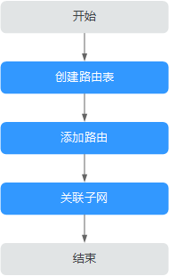

# 路由表简介

## 路由表

路由表由一系列路由规则组成，用于控制虚拟私有云内子网的出流量走向。VPC中的每个子网都必须关联一个路由表，一个子网一次只能关联一个路由表，但一个路由表可以关联多个子网。

## 默认路由表和自定义路由表

用户创建虚拟私有云时，系统会自动为其生成一个默认路由表，创建子网后，子网会自动关联默认路由表。

-   您可以在默认路由表中添加、删除和修改路由规则，但不能删除默认路由表。
-   创建VPN、云专线、云连接服务时，默认路由表会自动下发路由，该路由不能删除和修改。

您可以直接使用默认路由表，也可以为具有相同路由规则的子网创建一个自定义路由表，并将自定义路由表与子网关联。自定义路由表可以删除。

> **说明：** 
>-   子网关联自定义路由表仅影响子网的出流量走向，入流量仍然匹配默认路由表。
>-   当前自定义路由表需提交工单申请，如需使用自定义路由表，请在创建路由表页面单击“申请扩大配额”或在页面右上角单击“更多 \> 工单 \> 新建工单”申请扩大路由表配额。更多提交工单信息请参考[提交工单](https://support.huaweicloud.com/usermanual-ticket/zh-cn_topic_0127038618.html)。

创建自定义路由表的方法请参见[创建自定义路由表](创建自定义路由表.md)。

## 路由

路由即路由规则，在路由中通过配置目的地址、下一跳类型、下一跳地址等信息，来决定网络流量的走向。路由分为系统路由和自定义路由。

-   系统路由：系统自动添加且无法修改或删除的路由。

    创建路由表后，系统会自动在路由表中添加如下的系统路由，表示VPC内实例互通。

    -   目的地址是100.64.0.0/10、198.19.128.0/20的路由。
    -   目的地址是子网网段的路由。

        > **说明：** 
        >除以上系统路由外，系统还会自动添加目的地址是127.0.0.0/8的路由，表示本地回环地址。
        >系统路由和自定义路由均属于静态BGP路由。

-   自定义路由：可以修改和删除的路由。自定义路由的目地地址不能与系统路由的目地地址重叠。

    您可以通过添加自定义路由来自定义网络流量的走向，您需要指定目的地址、下一跳类型、下一跳地址。支持的下一跳类型如[表1](#table1727714140542)所示。

    **表 1**  下一跳类型

    
    <table><thead align="left"><tr id="zh-cn_topic_0118498988_route_0001_row13277814115411"><th class="cellrowborder" valign="top" width="24.310000000000002%" id="mcps1.2.4.1.1">
下一跳类型

    </th>
    <th class="cellrowborder" valign="top" width="46.97%" id="mcps1.2.4.1.2">
说明

    </th>
    <th class="cellrowborder" valign="top" width="28.720000000000002%" id="mcps1.2.4.1.3">
支持添加该类型路由的路由表

    </th>
    </tr>
    </thead>
    <tbody><tr id="zh-cn_topic_0118498988_route_0001_row112771014105411"><td class="cellrowborder" valign="top" width="24.310000000000002%" headers="mcps1.2.4.1.1 ">
服务器实例

    </td>
    <td class="cellrowborder" valign="top" width="46.97%" headers="mcps1.2.4.1.2 ">
将指向目的地址的流量转发到虚拟私有云内的一台ECS实例。

    </td>
    <td class="cellrowborder" valign="top" width="28.720000000000002%" headers="mcps1.2.4.1.3 "><ul id="zh-cn_topic_0118498988_ul14768115591513"><li>默认路由表</li><li>自定义路由表</li></ul>
    </td>
    </tr>
    <tr id="zh-cn_topic_0118498988_route_0001_row327761465419"><td class="cellrowborder" valign="top" width="24.310000000000002%" headers="mcps1.2.4.1.1 ">
扩展网卡

    </td>
    <td class="cellrowborder" valign="top" width="46.97%" headers="mcps1.2.4.1.2 ">
将指向目的地址的流量转发到虚拟私有云内的一台ECS实例的扩展网卡。

    </td>
    <td class="cellrowborder" valign="top" width="28.720000000000002%" headers="mcps1.2.4.1.3 "><ul id="zh-cn_topic_0118498988_ul129297014168"><li>默认路由表</li><li>自定义路由表</li></ul>
    </td>
    </tr>
    <tr id="zh-cn_topic_0118498988_row1370272516115"><td class="cellrowborder" valign="top" width="24.310000000000002%" headers="mcps1.2.4.1.1 ">
裸金属服务器自定义网络

    </td>
    <td class="cellrowborder" valign="top" width="46.97%" headers="mcps1.2.4.1.2 ">
将指向目的地址的流量转发到一个裸金属服务器自定义网络。

    </td>
    <td class="cellrowborder" valign="top" width="28.720000000000002%" headers="mcps1.2.4.1.3 "><ul id="zh-cn_topic_0118498988_ul13641746181615"><li>默认路由表</li><li>自定义路由表</li></ul>
    </td>
    </tr>
    <tr id="zh-cn_topic_0118498988_route_0001_row427719141546"><td class="cellrowborder" valign="top" width="24.310000000000002%" headers="mcps1.2.4.1.1 ">
VPN网关

    </td>
    <td class="cellrowborder" valign="top" width="46.97%" headers="mcps1.2.4.1.2 ">
将指向目的地址的流量转发到一个VPN网关。

    </td>
    <td class="cellrowborder" valign="top" width="28.720000000000002%" headers="mcps1.2.4.1.3 ">
自定义路由表

    </td>
    </tr>
    <tr id="zh-cn_topic_0118498988_route_0001_row62774144548"><td class="cellrowborder" valign="top" width="24.310000000000002%" headers="mcps1.2.4.1.1 ">
云专线网关

    </td>
    <td class="cellrowborder" valign="top" width="46.97%" headers="mcps1.2.4.1.2 ">
将指向目的地址的流量转发到一个云专线网关。

    </td>
    <td class="cellrowborder" valign="top" width="28.720000000000002%" headers="mcps1.2.4.1.3 ">
自定义路由表

    </td>
    </tr>
    <tr id="zh-cn_topic_0118498988_row972915476181"><td class="cellrowborder" valign="top" width="24.310000000000002%" headers="mcps1.2.4.1.1 ">
云连接

    </td>
    <td class="cellrowborder" valign="top" width="46.97%" headers="mcps1.2.4.1.2 ">
将指向目的地址的流量转发到云连接。

    </td>
    <td class="cellrowborder" valign="top" width="28.720000000000002%" headers="mcps1.2.4.1.3 ">
自定义路由表

    </td>
    </tr>
    <tr id="zh-cn_topic_0118498988_row7847531257"><td class="cellrowborder" valign="top" width="24.310000000000002%" headers="mcps1.2.4.1.1 ">
辅助弹性网卡

    </td>
    <td class="cellrowborder" valign="top" width="46.97%" headers="mcps1.2.4.1.2 ">
将指向目的地址的流量转发到虚拟私有云内的一台ECS实例的辅助弹性网卡。

    </td>
    <td class="cellrowborder" valign="top" width="28.720000000000002%" headers="mcps1.2.4.1.3 "><ul id="zh-cn_topic_0118498988_ul14108048122520"><li>默认路由表</li><li>自定义路由表</li></ul>
    </td>
    </tr>
    <tr id="zh-cn_topic_0118498988_route_0001_row112776144548"><td class="cellrowborder" valign="top" width="24.310000000000002%" headers="mcps1.2.4.1.1 ">
NAT网关

    </td>
    <td class="cellrowborder" valign="top" width="46.97%" headers="mcps1.2.4.1.2 ">
将指向目的地址的流量转发到一个NAT网关。

    </td>
    <td class="cellrowborder" valign="top" width="28.720000000000002%" headers="mcps1.2.4.1.3 "><ul id="zh-cn_topic_0118498988_ul1337415852619"><li>默认路由表</li><li>自定义路由表</li></ul>
    </td>
    </tr>
    <tr id="zh-cn_topic_0118498988_route_0001_row10277171416546"><td class="cellrowborder" valign="top" width="24.310000000000002%" headers="mcps1.2.4.1.1 ">
对等连接

    </td>
    <td class="cellrowborder" valign="top" width="46.97%" headers="mcps1.2.4.1.2 ">
将指向目的地址的流量转发到一个对等连接。

    </td>
    <td class="cellrowborder" valign="top" width="28.720000000000002%" headers="mcps1.2.4.1.3 "><ul id="zh-cn_topic_0118498988_ul39491419102618"><li>默认路由表</li><li>自定义路由表</li></ul>
    </td>
    </tr>
    <tr id="zh-cn_topic_0118498988_route_0001_row1781535195512"><td class="cellrowborder" valign="top" width="24.310000000000002%" headers="mcps1.2.4.1.1 ">
虚拟IP

    </td>
    <td class="cellrowborder" valign="top" width="46.97%" headers="mcps1.2.4.1.2 ">
将指向目的地址的流量转发到一个虚拟IP地址，可以通过该虚拟IP地址将流量转发到主备ECS。

    </td>
    <td class="cellrowborder" valign="top" width="28.720000000000002%" headers="mcps1.2.4.1.3 "><ul id="zh-cn_topic_0118498988_ul1236384412619"><li>默认路由表</li><li>自定义路由表</li></ul>
    </td>
    </tr>
    <tr id="zh-cn_topic_0118498988_route_0001_row1653212151559"><td class="cellrowborder" valign="top" width="24.310000000000002%" headers="mcps1.2.4.1.1 ">
VPC终端节点

    </td>
    <td class="cellrowborder" valign="top" width="46.97%" headers="mcps1.2.4.1.2 ">
将指向目的地址的流量转发到一个VPC终端节点。

    </td>
    <td class="cellrowborder" valign="top" width="28.720000000000002%" headers="mcps1.2.4.1.3 "><ul id="zh-cn_topic_0118498988_ul79021019173518"><li>默认路由表</li><li>自定义路由表</li></ul>
    </td>
    </tr>
    <tr id="zh-cn_topic_0118498988_row106012202612"><td class="cellrowborder" valign="top" width="24.310000000000002%" headers="mcps1.2.4.1.1 ">
云容器引擎

    </td>
    <td class="cellrowborder" valign="top" width="46.97%" headers="mcps1.2.4.1.2 ">
将指向目的地址的流量转发到一个云容器引擎的节点。

    </td>
    <td class="cellrowborder" valign="top" width="28.720000000000002%" headers="mcps1.2.4.1.3 "><ul id="zh-cn_topic_0118498988_ul65851620143510"><li>默认路由表</li><li>自定义路由表</li></ul>
    </td>
    </tr>
    <tr id="zh-cn_topic_0118498988_row171979509712"><td class="cellrowborder" valign="top" width="24.310000000000002%" headers="mcps1.2.4.1.1 ">
云防火墙

    </td>
    <td class="cellrowborder" valign="top" width="46.97%" headers="mcps1.2.4.1.2 ">
将指向目的地址的流量转发到一个云防火墙。

    </td>
    <td class="cellrowborder" valign="top" width="28.720000000000002%" headers="mcps1.2.4.1.3 "><ul id="zh-cn_topic_0118498988_ul212573303013"><li>默认路由表</li><li>自定义路由表</li></ul>
    </td>
    </tr>
    </tbody>
    </table>

    > **说明：** 
    >个别由系统下发的路由可供用户修改和删除，这取决于创建对端服务时是否已设置目的地址。
    >例如，创建NAT 网关时，系统会自动下发一条自定义类型的路由，没有明确指定目的地址（默认为0.0.0.0/0）,此时用户可修改该目的地址。而创建VPN网关时，可以指定远端子网，也就是路由表的目的地址，系统将下发系统类型的路由。如果在路由表页面更改路由将会导致与对端数据不一致，您可以前往对端服务页面修改远端子网来调整路由表中的路由规则。

## 自定义路由表配置流程

创建并配置自定义路由表的流程如[图1](#zh-cn_topic_0212076956_fig16862186152219)所示。

**图 1**  路由表配置流程  

1.  参考[创建自定义路由表](创建自定义路由表.md)创建自定义路由表。
2.  参考[添加自定义路由](添加自定义路由.md)添加自定义路由规则。
3.  参考[关联子网与路由表](关联子网与路由表.md)关联子网，关联成功后，路由规则对该子网生效。

## 约束与限制

-   每个虚拟私有云在创建成功后，会自动生成1个路由表，即默认路由表；如果要创建更多自定义路由表，需要申请扩大路由表配额。

    申请扩大配额的操作，请参考[提交工单](https://support.huaweicloud.com/usermanual-ticket/zh-cn_topic_0127038618.html)。

-   每个路由表最多添加200个路由。
-   默认路由表不能删除。
-   系统路由不能修改和删除。
-   由VPN、云专线、云连接服务下发到默认路由表中的路由不能修改和删除。
-   云容器引擎类型的路由不支持修改、复制和删除。
-   由VPC终端节点服务下发到默认路由表的网关类型终端节点的路由不能修改、复制和删除，并且自定义路由表中的网关类型终端节点的路由也不能修改和删除。

