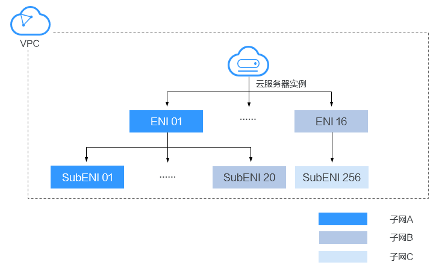

# 辅助弹性网卡简介

辅助弹性网卡（Submission Elastic Network Interfaces，以下简称SubENI）是一种基于弹性网卡的衍生资源，用于解决单个云服务器实例挂载的弹性网卡超出上限，不满足用户使用需要的问题。辅助弹性网卡通过VLAN子接口挂载在弹性网卡上，您可以通过创建辅助弹性网卡，使单个云服务器实例挂载更多网卡，实现灵活、高可用的网络方案配置。

辅助弹性网卡功能目前仅在“华北-北京四”、“华东-上海一”、“华南-广州”开放。

## 应用场景

辅助弹性网卡通过VLAN子接口挂载在弹性网卡上，其组网示意图如[图1](#fig11599171211328)所示。

**图 1**  辅助弹性网卡示意图  

单个云服务器实例支持绑定的弹性网卡数量有限，当因业务需要绑定超过弹性网卡上限的网卡时，可以通过为弹性网卡挂载辅助弹性网卡实现。

-   为云服务器实例配置多个分属于同一VPC内不同子网的辅助弹性网卡，每个辅助弹性网卡拥有不同的私网IP、弹性公网IP，可以分别承载云服务器实例的内网、外网和管理网流量。
-   辅助弹性网卡可配置独立安全组策略，从而实现网络隔离与业务流量分离。

## 约束与限制

-   单个云服务器实例支持绑定的辅助弹性网卡实例上限为256个，具体每种规格支持的SubENI数量由云服务器实例决定。

    目前仅支持c7（公测中，需要申请）、c6ne（仅用于容器）两种规格支持辅助弹性网卡功能，规格详细信息请参见[规格清单](https://support.huaweicloud.com/productdesc-ecs/zh-cn_topic_0159822360.html)。

-   辅助弹性网卡与挂载的弹性网卡必须在同一VPC，可以分属于不同子网以及安全组。
-   辅助弹性网卡当前仅支持更新其绑定的安全组，暂不支持其他属性的更新。
-   辅助弹性网卡不支持单独的流日志收集功能，辅助弹性网卡产生的流日志信息随挂载的弹性网卡一同生成。
-   辅助弹性网卡使用时需要在云服务器实例的网卡上创建VLAN子接口并配置对应规则。

    当云服务器实例重启时，需要重新创建VLAN子接口并配置私网IP地址、默认路由等规则，详细内容请参见[配置辅助弹性网卡](https://support.huaweicloud.com/usermanual-vpc/vpc_subeni_0003.html#section2)。

-   云服务器实例不支持通过辅助弹性网卡直接访问云上公共服务。
-   云服务器实例不支持通过辅助弹性网卡的私网IP使用CloudInit。

