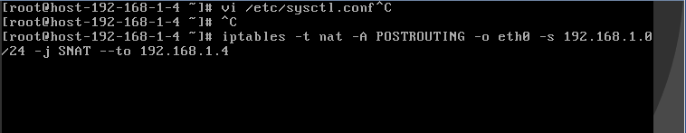
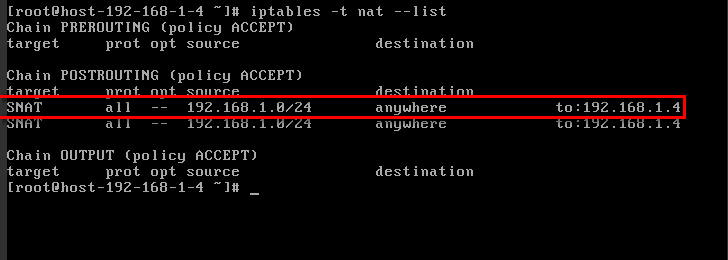

# 配置SNAT服务器<a name="vpc_route_0004"></a>

## 操作场景<a name="section46985825185725"></a>

当您在使用VPC的路由表功能时，需要在弹性云服务器上部署SNAT，使得VPC内其他没有绑定EIP的弹性云服务器可以通过它访问Internet。

该配置对VPC内所有子网生效。

## 前提条件<a name="section55962461185854"></a>

-   已拥有需要部署SNAT的弹性云服务器。
-   待部署SNAT的弹性云服务器操作系统为Linux操作系统。
-   待部署SNAT的弹性云服务器网卡已配置为单网卡。

## SNAT服务器与NAT网关服务差异<a name="section01119201297"></a>

NAT网关（NAT Gateway）能够为虚拟私有云内的云主机（弹性云服务器、裸金属服务器、云桌面）或者通过云专线/VPN接入虚拟私有云的本地数据中心的服务器，提供网络地址转换服务，使多个云主机可以共享弹性公网IP访问Internet或使云主机提供互联网服务。

对比SNAT服务器实例，NAT网关具有配置简单、灵活易用、支持跨子网部署、跨可用区部署、支持多种网关规格等优势，您可以在管理控制台选择“网络 \> NAT网关”进行体验。

更多内容请参见[《NAT网关用户指南》](https://support.huaweicloud.com/natgateway/index.html)。

## 操作步骤<a name="section27146196185725"></a>

1.  登录管理控制台。


1.  在管理控制台左上角单击，选择区域和项目。
2.  在系统首页，单击“计算 \> 弹性云服务器”。
3.  在右侧弹性云服务器界面，单击需要设置SNAT的弹性云服务器名称，进入弹性云服务器详情页面。
4.  在弹性云服务器详情页面单击“网卡”页签。
5.  单击网卡IP地址，在展开的网卡详情区域内设置“源/目的检查”状态为“关闭”。

    默认情况下，“源/目的检查”状态为“启用”，系统会检查弹性云服务器发送的报文中源IP地址是否正确，否则不允许弹性云服务器发送该报文。这有助于防止伪装报文攻击，提升安全性。但在SNAT场景中，SNAT实例起转发作用，这种保护机制会导致报文的发送者无法接收到返回的报文。这种保护机制可以通过设置“源/目的检查”状态为禁用。

6.  绑定EIP。
    -   为弹性云服务器的私有IP绑定EIP，详情请参见[为弹性云服务器申请和绑定弹性公网IP](为弹性云服务器申请和绑定弹性公网IP.md)。
    -   为弹性云服务器的虚拟IP绑定EIP，详情请参见[为虚拟IP地址绑定弹性公网IP或弹性云服务器](为虚拟IP地址绑定弹性公网IP或弹性云服务器.md)。

7.  打开待配置SNAT弹性云服务器详情页面，通过remote login登录服务器。
8.  执行如下命令，输入root密码，切换至root。

    **su - root**

9.  执行如下命令，检测弹性云服务器是否可以正常连接Internet。

    > **说明：** 
    >执行如下命令前，关闭SNAT服务器上响应的IPtables规则，开放安全组规则。

    **ping www.huawei.com**

    回显如下所示，表示弹性云服务器可以正常连接Internet。

    ```
    [root@localhost ~]# ping www.huawei.com
    PING www.a.shifen.com (xxx.xxx.xxx.xxx) 56(84) bytes of data.
    64 bytes from xxx.xxx.xxx.xxx: icmp_seq=1 ttl=51 time=9.34 ms
    64 bytes from xxx.xxx.xxx.xxx: icmp_seq=2 ttl=51 time=9.11 ms
    64 bytes from xxx.xxx.xxx.xxx: icmp_seq=3 ttl=51 time=8.99 ms
    ```

10. 执行如下命令，查看Linux操作系统的IP转发功能是否已开启。

    **cat /proc/sys/net/ipv4/ip\_forward**

    回显结果：1为开启，0为关闭，默认为0。

    -   是，执行[14](#li2168883919851)。
    -   否，执行[12](#li3948189019612)，开启Linux的IP转发功能。

    许多操作系统支持路由报文。操作系统需要在转发报文前将报文的源IP地址转换成操作系统的IP地址，因此，发送的报文带有公共发送者的IP地址，而返回的报文能够原路返回，这种方式称为SNAT。操作系统需要跟踪转换过IP地址的报文，确保返回的报文中目的IP地址可以被重写，且报文能够转发给原始的报文发送者。这一过程实现需要启用IP转发功能，并设置SNAT规则。

11. <a name="li3948189019612"></a>使用vi打开“/etc/sysctl.conf”文件，修改net.ipv4.ip\_forward = 1，按“**:wq**”保存退出。
12. 执行如下命令，使修改生效。

    **sysctl -p /etc/sysctl.conf**

13. <a name="li2168883919851"></a>配置SNAT。

    执行如下命令，允许网段（例如：192.168.1.0/24）内所有弹性云服务器内访外配置。实例如[图1](#fig27328760201321)所示。

    **iptables -t nat -A POSTROUTING -o eth0 -s subnet -j SNAT --to nat-instance-ip**

    **图 1**  配置SNAT<a name="fig27328760201321"></a>  
    

    > **说明：** 
    >-   如需实现重启后规则不丢失，则需把规则写在/etc/rc.local文件中。
    >    1.  执行以下命令进入/etc/rc.local文件。
    >        **vi /etc/rc.local**
    >    2.  执行[14](#li2168883919851)配置SNAT
    >    3.  执行以下命令保存并退出。
    >        **:wq**
    >    4.  执行以下命令添加rc.local文件的执行权限。
    >        **\# chmod +x /etc/rc.local**
    >-   为保证配置正常生效，请执行**iptables -L**命令查看已配置的规则是否有冲突。

14. 执行如下命令，查看是否配置成功。如[图2](#fig8358771201535)所示，则表示配置成功（例如：192.168.1.0/24）。

    **iptables -t nat --list**

    **图 2**  验证设置<a name="fig8358771201535"></a>  
    

15. 添加自定义路由，详见[添加自定义路由](添加自定义路由-1.md)。

    目的地址是0.0.0.0/0，下一跳地址是SNAT服务器的私有IP或者虚拟IP（例如：192.168.1.4）。


按以上操作完成配置后，如果出现网络不通等情况，请检查您的安全组、网络ACL配置，是否放通了对应流量。

