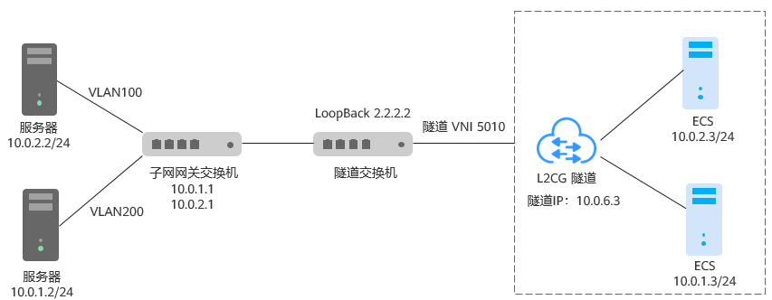
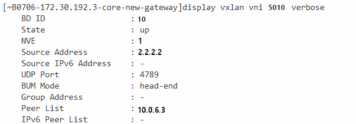

# 配置远端隧道网关

## 操作场景

本文旨在指导用户在线下数据中心（IDC）的VXLAN隧道交换机上配置隧道。

针对用户IDC的常见组网场景提供配置参考。

本文以华为CE6850交换机为例。

> **说明：** 
>二层连接网关功能目前仅在“华东-上海一”、“华南-广州”、“华北-北京四”开放，且还在公测期间，请申请公测权限后使用。

## 操作步骤

**场景：规划的二层网络的子网网关和VXLAN隧道不在同个交换机上**

**此场景规划的云上隧道IP是10.0.6.3，用户IDC侧隧道交换机的隧道IP是2.2.2.2，隧道vni是5010，仅供参考。**

远端隧道网关的配置方法：配置IDC隧道交换机，将二层子网VLAN的流量引流到隧道。

**图 1**  不同交换机  

1.  登录隧道交换机，执行命令system-view，进入系统视图。
2.  进入loopback 0接口视图，配置隧道IP。

    配置示例：

    **interface loopback 0**

    **ip address 2.2.2.2 255.255.255.255**

1.  执行命令quit，退出接口视图，返回到系统视图。
2.  执行命令bridge-domain，进入BD视图，配置BD所对应VXLAN的VNI。

    配置示例：

    **bridge-domain 10**

    **vxlan vni 5010**

3.  执行命令quit，退出BD视图，返回到系统视图。
4.  创建二层子接口，通过子接口将二层网络指定的VLAN引流到隧道。

    配置示例：

    **interface  **10ge 1/0/2.1**  mode l2**

    **encapsulation dot1q vid 100**

    **bridge-domain 10**

1.  执行命令interface nve，创建NVE接口，并进入NVE接口视图，配置VXLAN隧道源端VTEP的IP地址：2.2.2.2。

    配置示例：

    **interface nve1**

    **source 2.2.2.2**

1.  在nve接口视图下，执行命令vni，配置VNI的头端复制列表。

    配置示例：

    **vni 5010 head-end peer-list 10.0.6.3**

2.  在系统视图下，执行如下命令查看VXLAN的配置状态。

    **display vxlan vni 5010 verbose**

    **图 2**  VXLAN配置状态  
    

    up表示隧道状态正常。

    如需更多配置排查，相关命令可参考实际交换机型号的产品文档。

