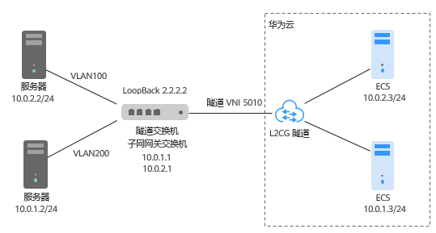

# 配置远端隧道网关

## 操作场景

针对客户IDC的两种组网场景提供不同的配置参考。

本文以华为CE6850交换机为例。

## 操作步骤

**场景一：规划的二层网络的子网网关和VXLAN隧道不在同个交换机上**

<<<<<<< HEAD
远端隧道网关的配置方法：配置IDC交换机，将二层子网VLAN的流量引流到隧道。

**图 1**  不同交换机  

=======
远端隧道网关的配置方法：登录隧道交换机配置交换机将二层子网VLAN的流量引流到隧道。
>>>>>>> 7bff1c2228ff00615e053514739770b5dc1543e3

1.  登录隧道交换机，执行命令system-view，进入系统视图。
2.  创建二层子接口，通过子接口将二层网络指定的VLAN引流到隧道。参考如下配置。

    **interface eth-trunk4.1 mode l2**

    **encapsulation dot1q vid 571**

    **bridge-domain 10**

    **commit**

1.  执行命令bridge-domain bd-id，进入BD视图，配置BD所对应的VXLAN的VNI，参考如下配置。

    **bridge-domain 10**

    **vxlan vni 5010**

    **commit**

2.  执行命令quit，退出BD视图，返回到系统视图。
3.  执行命令loopback，进入接口视图，配置IP。参考如下配置。

    **interface LoopBack0**

    **ip address 192.168.71.199 255.255.255.255**

    **commit**

1.  执行命令interface nve nve-number，创建NVE接口，并进入NVE接口视图，配置VXLAN隧道源端VTEP的IP地址，参考如下配置。

    **interface NVE1**

    **source 192.168.71.199**

1.  执行命令vni，配置交换机。参考如下配置。

    **vni 5010 head-end peer-list 192.168.22.99**

    **commit**

**场景二：规划的二层网络的子网网关和VXLAN隧道在同个交换机上**

<<<<<<< HEAD
远端隧道网关的配置方法：配置IDC二层子网网关，将二层子网VLAN的流量引流到隧道。

**图 2**  同个交换机  

=======
远端隧道网关的配置方法：登录隧道交换机配置二层子网网关，配置交换机将二层子网VLAN的流量引流到隧道。
>>>>>>> 7bff1c2228ff00615e053514739770b5dc1543e3

1.  登录隧道交换机，执行命令system-view，进入系统视图。
2.  执行命令interface vbdif bd-id，创建VBDIF接口，并进入VBDIF接口视图，配置网关。

    **interface Vbdif20**

    **ip address 10.0.1.1 255.255.255.0**

    **ip address 10.0.2.1 255.255.255.0 sub**

<<<<<<< HEAD
3.  创建二层子接口，通过子接口将二层网络指定的VLAN引流到隧道。参考如下配置。
=======
3.  创建二层子接口，通过子接口将二层网络指定的vlan引流到隧道。参考如下配置。
>>>>>>> 7bff1c2228ff00615e053514739770b5dc1543e3

    **interface GE1/0/0.1 mode l2**

    **encapsulation dot1q vid 100**

    **bridge-domain 10**

    **commit**

4.  执行命令bridge-domain bd-id，进入BD视图，配置BD所对应的VXLAN的VNI，参考如下配置。

    **bridge-domain 10**

    **vxlan vni 5010**

    **commit**

5.  执行命令quit，退出BD视图，返回到系统视图。
6.  执行命令loopback，进入接口视图，配置IP。参考如下配置。

    **interface LoopBack0**

    **ip address 2.2.2.2 255.255.255.255**

    **commit**

7.  执行命令interface nve nve-number，创建NVE接口，并进入NVE接口视图，配置VXLAN隧道源端VTEP的IP地址，参考如下配置。

    **interface NVE1**

    **source 2.2.2.2**

8.  执行命令vni，配置交换机。参考如下配置。

    **vni 5010 head-end peer-list 192.168.22.99**

    **commit**

