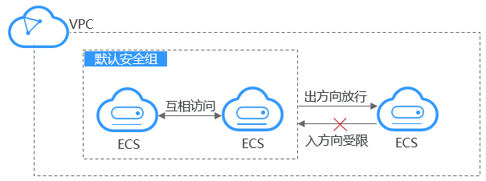

# 默认安全组和规则

系统会为每个用户默认创建一个安全组，默认安全组的规则是在出方向上的数据报文全部放行，入方向访问受限，安全组内的云服务器无需添加规则即可互相访问。

如[图1](#fig997718156161)所示。

**图 1**  默认安全组  

> **说明：** 
>-   您无法删除默认安全组，但可以修改默认安全组的规则。
>-   安全组需在网络互通的情况下生效。若实例属于不同VPC，但同属于一个安全组，则此安全组不生效，您可以使用对等连接等产品建立VPC连接互通。VPC连接请参见[应用场景](https://support.huaweicloud.com/productdesc-vpc/overview_0002.html)。

默认安全组规则如[表1](#table1580115155277)所示：

**表 1**  默认安全组规则

<table><thead align="left"><tr id="row15801415182713"><th class="cellrowborder" valign="top" width="9%" id="mcps1.2.6.1.1">
方向

</th>
<th class="cellrowborder" valign="top" width="8%" id="mcps1.2.6.1.2">
协议

</th>
<th class="cellrowborder" valign="top" width="9%" id="mcps1.2.6.1.3">
端口范围

</th>
<th class="cellrowborder" valign="top" width="31%" id="mcps1.2.6.1.4">
目的地址/源地址

</th>
<th class="cellrowborder" valign="top" width="43%" id="mcps1.2.6.1.5">
说明

</th>
</tr>
</thead>
<tbody><tr id="row1280251562712"><td class="cellrowborder" valign="top" width="9%" headers="mcps1.2.6.1.1 ">
出方向

</td>
<td class="cellrowborder" valign="top" width="8%" headers="mcps1.2.6.1.2 ">
全部

</td>
<td class="cellrowborder" valign="top" width="9%" headers="mcps1.2.6.1.3 ">
全部

</td>
<td class="cellrowborder" valign="top" width="31%" headers="mcps1.2.6.1.4 ">
目的地址：0.0.0.0/0

</td>
<td class="cellrowborder" valign="top" width="43%" headers="mcps1.2.6.1.5 ">
允许所有出站流量的数据报文通过。

</td>
</tr>
<tr id="row1980261512714"><td class="cellrowborder" valign="top" width="9%" headers="mcps1.2.6.1.1 ">
入方向

</td>
<td class="cellrowborder" valign="top" width="8%" headers="mcps1.2.6.1.2 ">
全部

</td>
<td class="cellrowborder" valign="top" width="9%" headers="mcps1.2.6.1.3 ">
全部

</td>
<td class="cellrowborder" valign="top" width="31%" headers="mcps1.2.6.1.4 ">
源地址：当前安全组 ID (例如：sg-<em id="i16664539183815">xxxxx</em>)

</td>
<td class="cellrowborder" valign="top" width="43%" headers="mcps1.2.6.1.5 ">
仅允许安全组内的云服务器彼此通信，丢弃其他入站流量的全部数据报文。

</td>
</tr>
<tr id="row1680231514278"><td class="cellrowborder" valign="top" width="9%" headers="mcps1.2.6.1.1 ">
入方向

</td>
<td class="cellrowborder" valign="top" width="8%" headers="mcps1.2.6.1.2 ">
TCP

</td>
<td class="cellrowborder" valign="top" width="9%" headers="mcps1.2.6.1.3 ">
22

</td>
<td class="cellrowborder" valign="top" width="31%" headers="mcps1.2.6.1.4 ">
源地址：0.0.0.0/0

</td>
<td class="cellrowborder" valign="top" width="43%" headers="mcps1.2.6.1.5 ">
允许所有IP地址通过SSH远程连接到Linux云服务器。

</td>
</tr>
<tr id="row0011153117"><td class="cellrowborder" valign="top" width="9%" headers="mcps1.2.6.1.1 ">
入方向

</td>
<td class="cellrowborder" valign="top" width="8%" headers="mcps1.2.6.1.2 ">
TCP

</td>
<td class="cellrowborder" valign="top" width="9%" headers="mcps1.2.6.1.3 ">
3389

</td>
<td class="cellrowborder" valign="top" width="31%" headers="mcps1.2.6.1.4 ">
源地址：0.0.0.0/0

</td>
<td class="cellrowborder" valign="top" width="43%" headers="mcps1.2.6.1.5 ">
允许所有IP地址通过RDP远程连接到Windows云服务器。

</td>
</tr>
</tbody>
</table>

